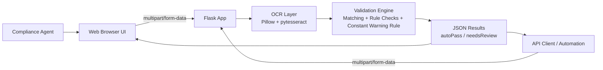
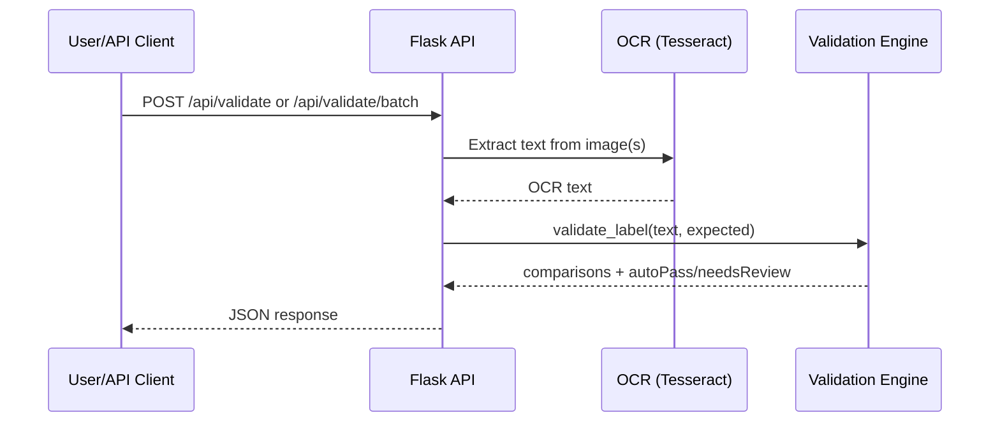
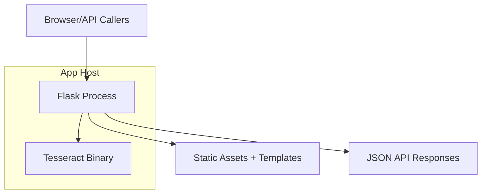

# Architecture Overview

This document describes how the prototype is structured, how data moves through the system, and which technologies are used.

## 1) High-level architecture

The application is a single Flask service that provides:

- Server-rendered web UI (`/`)
- Health endpoint (`/health`)
- Validation APIs (`/api/validate`, `/api/validate/batch`)
- OCR + field-comparison business logic in a shared backend path

Both the browser workflow and external API clients use the same validation logic on the backend.



## 2) Technology stack

### Runtime and framework

- **Python 3.13** (compatible with 3.11+)
- **Flask 3.1** for web serving and API routing

### OCR and image handling

- **Tesseract OCR (system binary)** for text extraction
- **pytesseract** Python wrapper for invoking Tesseract
- **Pillow (PIL)** for image loading/conversion
- Multi-variant OCR preprocessing + staged candidate evaluation for speed/quality balance

### Frontend

- Server-rendered HTML template
- Vanilla JavaScript + CSS
- Web UI sends uploaded images to backend API and renders returned comparisons

### Quality/automation

- `unittest` test suite for helper logic and endpoints
- GitHub Actions CI workflow for syntax + tests

## 3) Core backend modules and responsibilities

- `app.py`
  - Development entrypoint
  - Creates Flask app via factory
  - Re-exports legacy symbols for compatibility

- `ttb_label_verifier/__init__.py`
  - Application factory (`create_app`)
  - Blueprint registration

- `ttb_label_verifier/routes.py`
  - Route handlers (`/`, `/health`, `/api/validate`, `/api/validate/batch`)
  - Multipart/form-data parsing
  - Required-field validation for expected metadata
  - Batch orchestration and error handling

- `ttb_label_verifier/ocr.py`
  - OCR integration (`ocr_image_file`)
  - PIL conversion and Tesseract invocation
  - OCR dependency and runtime availability checks

- `ttb_label_verifier/validation.py`
  - Matching helpers (`normalize_loose`, `similarity`, regex extraction)
  - Field detection and scoring
  - Rule enforcement (`govWarning` strict handling with backend constant text)
  - Alcohol format/proof checks
  - Conditional origin skip for U.S./state inputs
  - Conditional age requirement by class/type code and age statement validation
  - Result assembly (`validate_label`)

- `static/app.js`
  - Collect expected metadata from UI
  - Upload one/many images to `/api/validate/batch`
  - Render summary and per-label comparison tables

- `templates/index.html`
  - UI layout for metadata fields, file upload, and results

## 4) Request/response flow

### Web app path

1. User enters expected label metadata in UI.
2. User uploads one or more label images.
3. Browser sends multipart request to `/api/validate/batch`.
4. Backend extracts text with Tesseract.
5. Backend runs comparison rules and returns JSON.
6. UI renders per-field PASS/REVIEW and batch totals.

### API automation path

- Supports **multipart image mode only** (backend performs OCR).
- All expected metadata fields are required from callers **except** `govWarning`.
- `govWarning` is always validated against a backend constant with exact case and wording.
- `alcoholContent` is numeric percentage input; OCR text must include required alc/alcohol + by|/ + vol/volume phrasing.
- If proof appears in OCR text, proof must match $2 \times \text{ABV}$.
- `ageYears` is required only when class/type rules require age.



## 5) Package/module interaction

```mermaid
flowchart TB
    Entry[app.py] --> Factory[create_app() in ttb_label_verifier/__init__.py]
    Factory --> Routes[routes.py Blueprint]
    Routes --> OCR[ocr.py]
    Routes --> Validation[validation.py]
    Routes --> Templates[templates/index.html]
    Templates --> Static[static/app.js + static/styles.css]
```

## 6) Validation rules summary

- Fuzzy matching for most fields (case/punctuation tolerant)
- Regex-first extraction for `netContents` and `origin`
- Strict warning validation uses backend constant text:
  - exact warning text presence
  - uppercase `GOVERNMENT WARNING:` header required
  - expected value is not provided by API callers
- Warning failures return closest detected text + reason details
- Alcohol validation requires `%` + `alc/alcohol` with `vol/volume` via `by` or `/`; `ABV` is rejected
- Proof validation enforced when proof appears
- Origin validation is skipped for U.S./USA/state expected values
- Age statement comparison is added as another result row when required/provided

## 7) API contract summary

- `POST /api/validate`
  - Required: `multipart/form-data`, `image`, and `expected` with:
    - `brandName`
    - `classTypeCode`
    - `alcoholContent` (number)
    - `netContents`
    - `bottler`
    - `origin`
    - `ageYears` (required only when class/type requires age)

- `POST /api/validate/batch`
  - Required: `multipart/form-data`, `images`
  - Also required either:
    - shared `expected` object (same required fields above), or
    - `expectedList` (same length as images; each object has same required fields)

Invalid content type or missing required fields return `400`.
Missing OCR runtime returns `503`.

## 8) Deployment model

The prototype runs as a single service process with local OCR dependencies.



  ## 9) Operational notes

- If Tesseract is unavailable on host PATH, image-upload API mode returns `503`.
- Batch processing is currently sequential for predictable behavior.
- CI runs in `.github/workflows/ci.yml`; Azure deployment pipeline is in `.github/workflows/deploy-azure.yml`.

  ## 10) Future architecture evolution

- Add async/background queue for large batches.
- Add preprocessing pipeline (deskew/denoise/glare mitigation).
- Add persistence layer for audit trails and historical metrics.
- Add role-based auth if integrated into production workflows.
