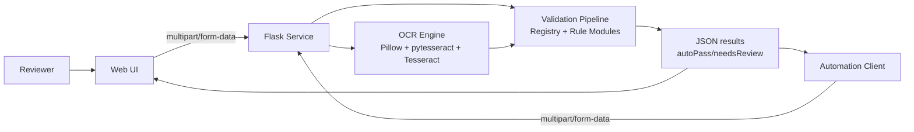
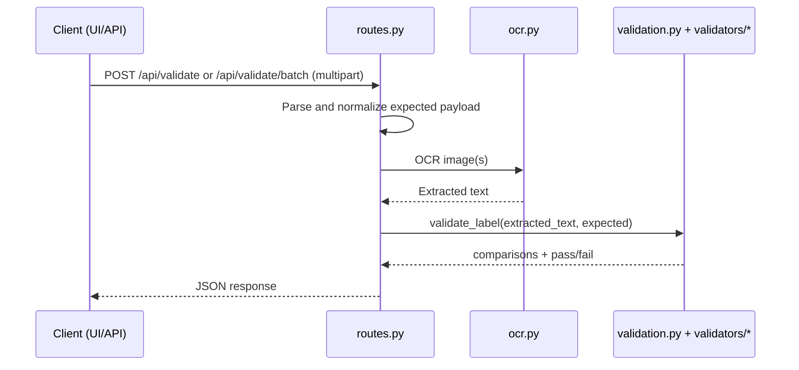

# Architecture Overview

This document describes the current architecture and data flow.

## 1) System shape

The app is a single Flask service with:

- server-rendered UI at `/`
- API endpoints for config and validation
- local OCR processing via Tesseract
- shared validation pipeline used by both UI and API clients

## 2) Main backend modules

- `app.py`
  - development entrypoint (`port 5001`)

- `ttb_label_verifier/__init__.py`
  - app factory (`create_app`)
  - blueprint registration

- `ttb_label_verifier/routes.py`
  - route handlers:
    - `GET /`
    - `GET /health`
    - `GET /api/config`
    - `GET /api/openapi.yaml`
    - `POST /api/validate`
    - `POST /api/validate/batch`
  - request parsing and required-field checks
  - batch limits and error mapping

- `ttb_label_verifier/ocr.py`
  - OCR dependency checks
  - image preprocessing variants
  - staged OCR candidate scoring
  - returns best extracted text

- `ttb_label_verifier/request_models.py`
  - typed normalization of incoming `expected` payload (`NormalizedExpected`)
  - required-field validation with conditional `ageYears`

- `ttb_label_verifier/validation.py`
  - orchestration layer for field validation
  - registry dispatch via `FIELD_VALIDATOR_REGISTRY`
  - final comparison row assembly and `autoPass` computation

- `ttb_label_verifier/validators/`
  - `definitions.py`: field labels, warning constant, required keys
  - `parsing.py`: percentage/age/boolean parsing
  - `policy.py`: class-code age policy, origin skip policy, class code label loading
  - `rules.py`: warning/alcohol/class code/age/additive rule logic
  - `registry.py`: key-to-validator mapping
  - `text.py`: normalization and fuzzy-match helpers

- `ttb_label_verifier/frontend_data.py`
  - loads frontend data from `static/data/countries.json` and `static/data/frontend_config.json`

## 3) Frontend modules

- `templates/index.html` renders the UI shell.
- `static/js/main.js` is the browser entrypoint.
- `static/js/form.js` handles input collection/sanitization/validation helpers.
- `static/js/api-client.js` sends batch requests.
- `static/js/guided-selection.js` drives class/type guided selector.
- `static/js/render.js` renders summary and result cards.

Frontend config and static lists are externalized:

- `static/data/countries.json`
- `static/data/frontend_config.json`

`GET /api/config` publishes backend-owned config used by the frontend.

## 4) Request flow

## 5) Validation behavior (current)

- Fuzzy matching for standard text fields.
- Government warning validation enforces uppercase header and full warning word coverage with OCR-tolerant close-token matching.
- Alcohol validation requires `%` + `alc/alcohol` + `by|/` + `vol/volume`; `ABV` is rejected.
- If proof appears, proof consistency is enforced with $\text{proof} = 2 \times \text{ABV}$.
- Origin validation is skipped when expected origin is U.S./U.S. alias/state.
- Age comparison row is included when class policy requires age or `ageYears` is provided.
- Optional additive rows are included when additive flags are set.

## 6) API contract notes

- Validation endpoints accept only `multipart/form-data` uploads.
- `expected` must include:
  - `brandName`, `classTypeCode`, `alcoholContent`, `netContents`, `bottler`, `bottlerAddress`, `origin`
- `ageYears` is conditionally required by class/type policy.
- `govWarning` is backend-enforced and not caller-provided.
- Batch max size is loaded from frontend config and enforced server-side.

## 7) Documentation and schema

- OpenAPI schema: `docs/openapi.yaml`
- Examples: `docs/examples/*.json`
- Schema is served at `GET /api/openapi.yaml`.

## 8) Operational notes

- OCR requires system Tesseract. If unavailable, OCR endpoints return `503`.
- Batch processing is synchronous/sequential.
- CI workflow: `.github/workflows/ci.yml`
- Azure deploy workflow: `.github/workflows/main_ttblabelverifyer.yml`
